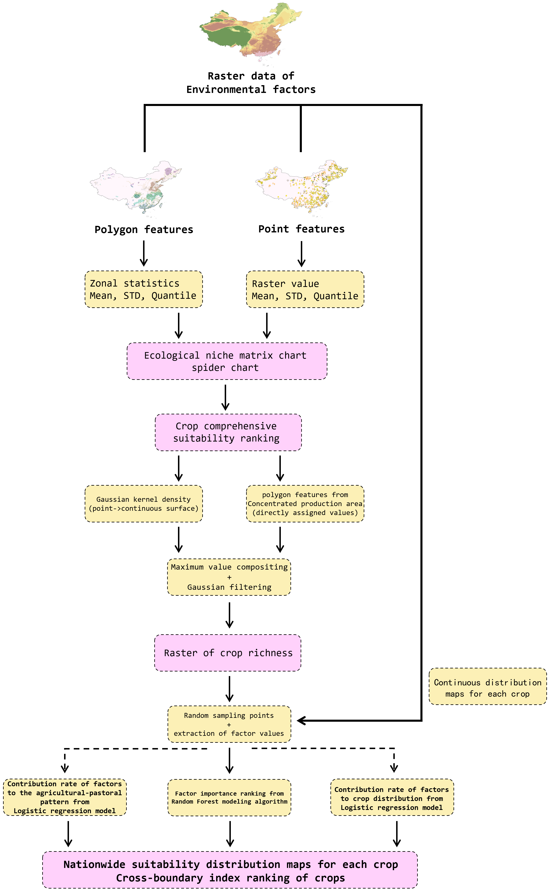

# Climate Suitability of Major Crop Distribution and Agricultural-Pastoral Zoning in China
[](https://github.com/DonaldTrump-coder/china-crop-climatic-suitability)&#160;
[](https://donaldtrump-coder.github.io/china-crop-climatic-suitability/)&#160;
[](https://www.modelscope.cn/datasets/Donald123456/ChinaAgroEco)&#160;
[](https://github.com/DonaldTrump-coder/china-crop-climatic-suitability)&#160;
<br>

[Central South University](https://www.csu.edu.cn/)<br>
**Contributors:** [Haojun Tang](https://donaldtrump-coder.github.io/)<br>

## Overview
The **code repository** for the GIS-based spatial analysis of crop climatic suitability and agricultural-pastoral zoning in China, used for data processing and computation. For the full analysis results with visualizations, visit the **[Project Page](https://donaldtrump-coder.github.io/china-crop-climatic-suitability/)**.<br>


## Environment
run
```bash
conda create -n GIS python=3.9
conda activate GIS
pip install -r requirements.txt
```
Download the data from [ModelScope](https://www.modelscope.cn/datasets/Donald123456/ChinaAgroEco). You can directly run with lfs:
```bash
git lfs install
git clone https://www.modelscope.cn/datasets/Donald123456/ChinaAgroEco.git
```

## Code
Run `python *.py` in the environment to process or analyze for the data.
| Python Script | Description |
|---------------|-------------|
| `process_mean.py` | Compute multi-year mean temperature or precipitation raster from annual mean temperature or precipitation series (1901–2024). |
| `process_accumulated.py` | Compute multi-year mean accumulated GDD raster from annual GDD series (1950–2024). |
| `gen_iso.py` | Generate contour shapefiles from rasters — temperature contours at 5°C interval, precipitation contours at 200 mm interval. |
| `richness.py` | Kernel density estimation from crop point/polygon distribution data to produce crop species richness raster. |
| `areas.py` | Logistic regression modeling of crop distribution suitability against environmental variables, plus agro-pastoral zone classification. |
| `crop_factors.py` | Maxent species distribution modeling (via elapid) to identify dominant environmental drivers for each crop. |
| `get_factors.py` | Random Forest regression on crop richness to quantify importance ranking of environmental factors. |

## Citations
If you find our work helpful, please cite:<br>
data:
```bibtex
@misc{tang2026chinaagroeco,
  author    = {Haojun Tang},
  title     = {{ChinaAgroEco}: A Multi-Source Agro-Ecological Dataset for China},
  year      = {2026},
  publisher = {ModelScope},
  howpublished = {\url{https://www.modelscope.cn/datasets/Donald123456/ChinaAgroEco}},
}
```

analysis:
```bibtex
@misc{tang2026cropsuit,
  author    = {Tang, Haojun},
  title     = {Climate Suitability of Major Crop Distribution and Agricultural-Pastoral Zoning in China},
  year      = {2026},
  publisher = {GitHub},
  howpublished = {\url{https://github.com/DonaldTrump-coder/china-crop-climatic-suitability}},
}
```

## License
This project is licensed under the Apache License 2.0. See [LICENSE](./LICENSE) details.
